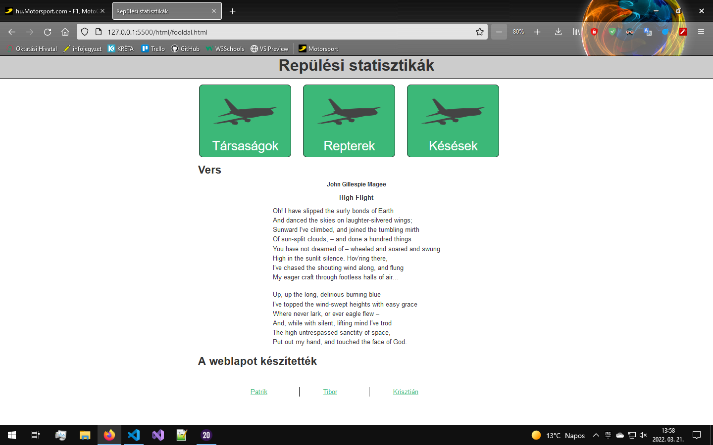
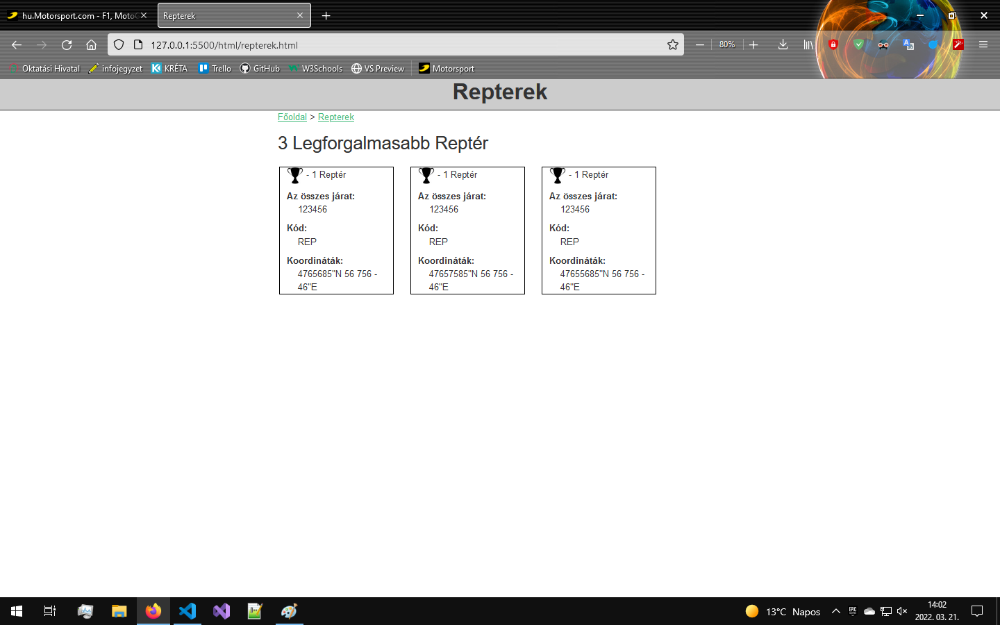
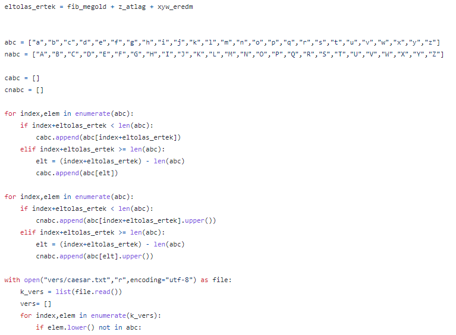
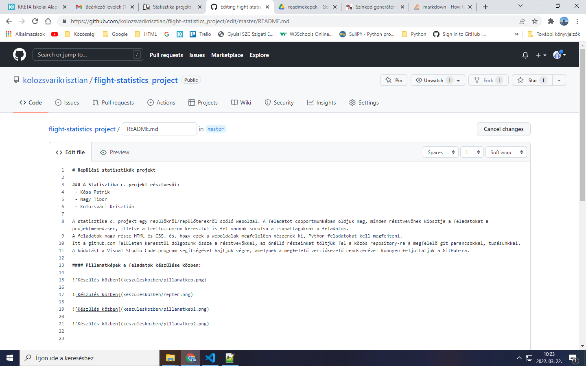

# Repülési statisztikák projekt

### A Statisztika c. projekt résztvevői:
 - Kása Patrik
 - Nagy Tibor
 - Kolozsvári Krisztián

A statisztika c. projekt egy repülőkről/repülőterekről szóló weboldal. A feladatot csoportmunkában oldjuk meg, minden résztvevőnek kiosztja a feladatokat a projektmenedzser, illetve a trello.com-on keresztül is fel vannak sorolva a csapattagoknak a feladatok.
A feladatok nagy része HTML és CSS, és, hogy ezek a weboldalak megfelelően nézzenek ki, Python feladatokat kell megfejteni.
Itt a github.com felületen keresztül dolgozunk össze a résztvevőkkel, az önálló részeinket töltjük fel a közös repository-ra a megfelelő git parancsokkal, tudásunkkal.
A kódolást a Visual Studio Code program segítségével hajtjuk végre, amelynek a megfelelő verziókezelő rendszerével könnyen feljuttatjuk a GitHub-ra.

#### Pillanatképek a feladatok készülése közben:

#### Trello tábla, ahol követjük a feladatokat:

#### GitHub README.md szerkesztése:

