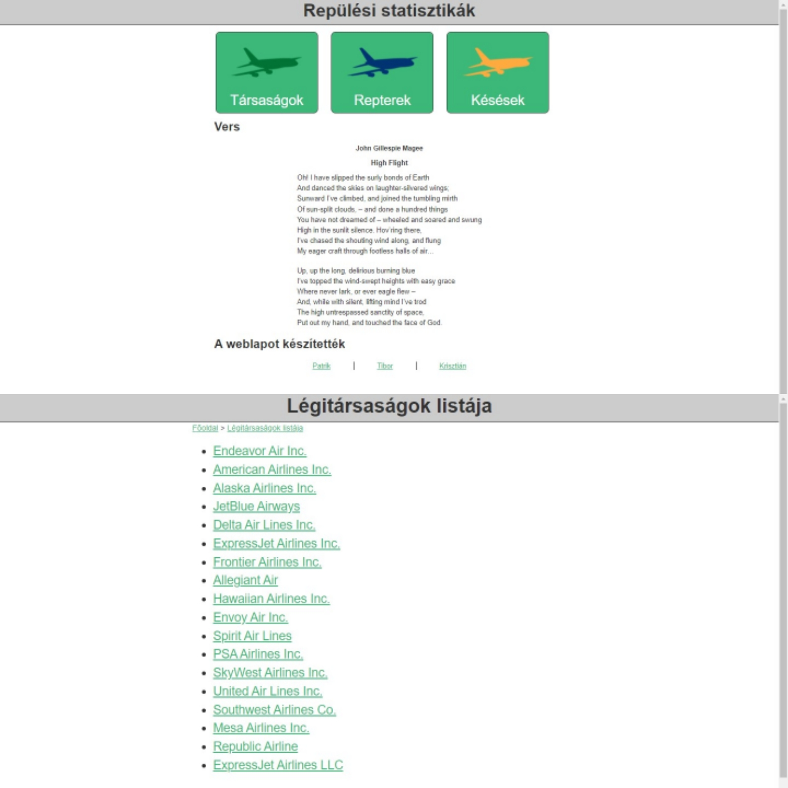
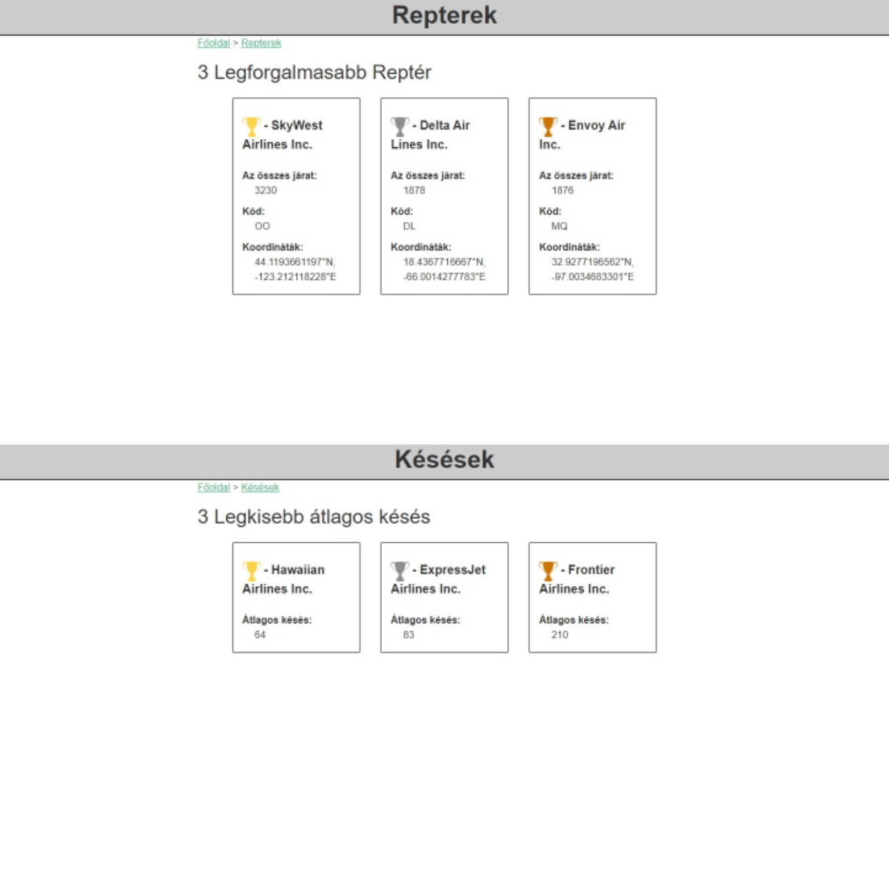

# Repülési statisztikák projekt

## A projekt alatt

A projekt alatt 3 fős csapatban dolgoztunk, projektmenedzser irányításával.

### A csapat tagjai:

 - Kása István Patrik
 - Nagy Tibor
 - Kolozsvári László Krisztián
 
Egy repüléssel kapcsolatos statisztikai weboldalt kellett létrehoznunk.

### A weboldal felépítése:
 - Főoldal
 - Légitársaságok Listája
 - Légitársaság oldalak
 - Repterek oldal
 - Késések oldal
 - Önéletrajz oldalak
 
Még a weboldal létrehozása előtt többlépcsős feltörési feladat várt ránk, hogy a rejtjelezetten megkapott vers szövegét megtudjuk, amit a főoldalon kellett megjeleníteni.

Szintén feladat volt a megjelenítendő adatok kinyerése a forrásul kapott Excel táblázatból, és internetes gyűjtőmunka a megjelenítendő képek, ikonok, koordináták tekintetében.

### A feladataink között volt:

 - HTML és CSS fejlesztés
 - JavaScript fejlesztés
 - Képek méretezése és vágása
 - Ikonok színezése
 - Adat elemzés CSV file-okból
 - Fájl olvasás és manipulálás szabadon választott programozói környezetben
 - Képek gyűjtése internetről
 - Dokumentáció készítése 

A statisztika c. projekt egy repülőkről/repülőterekről szóló weboldal. A feladatot csoportmunkában oldjuk meg, minden résztvevőnek kiosztja a feladatokat a projektmenedzser, illetve a trello.com-on keresztül is fel vannak sorolva a csapattagoknak a feladatok.
A feladatok nagy része HTML és CSS, és, hogy ezek a weboldalak megfelelően nézzenek ki, Python feladatokat kell megfejteni.
Itt a github.com felületen keresztül dolgozunk össze a résztvevőkkel, az önálló részeinket töltjük fel a közös repository-ra a megfelelő git parancsokkal, tudásunkkal.
A kódolást a Visual Studio Code program segítségével hajtjuk végre, amelynek a megfelelő verziókezelő rendszerével könnyen feljuttatjuk a GitHub-ra.

#### Pillanatképek a feladatok készülése közben:

#### Trello tábla, ahol követjük a feladatokat:

#### GitHub README.md szerkesztése:

A python feladatok megfejtése után elkezdtük a weboldalak kódolását. A közös csapatmunka és együttműködés hatására határidőn belül végeztünk a feladatokkal. A határidőket a projektmenedzser beállította a trello.com táblán keresztül, ahol az egész munkafolyamatot tudtuk követni.
Az elkészült feladatok itt a GitHub-on keresztül érhetőek el.
